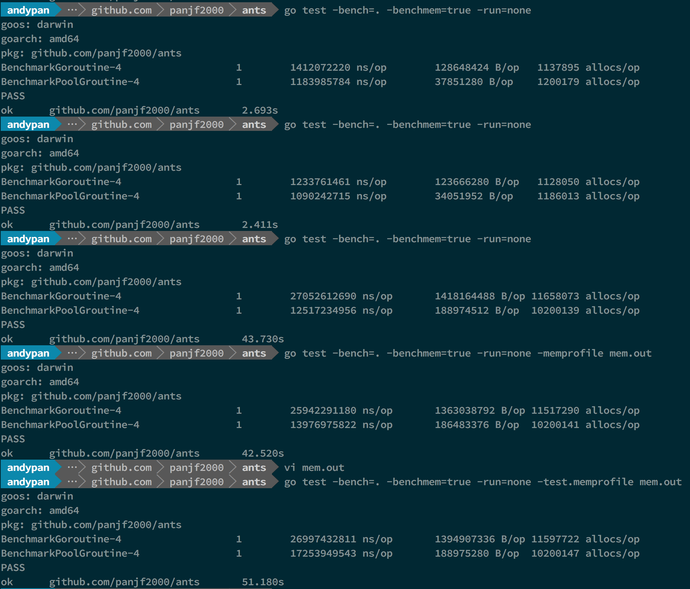
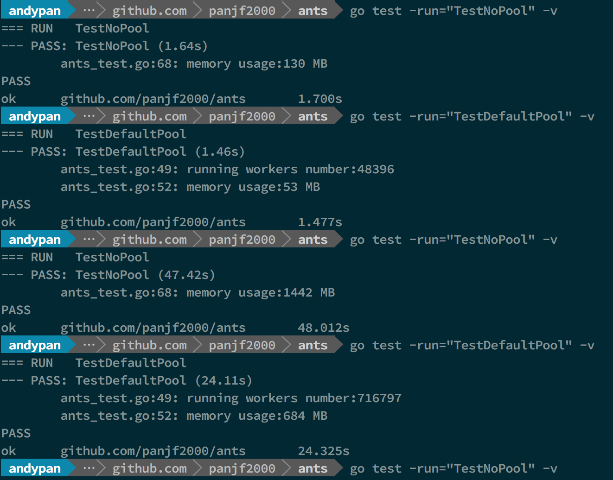
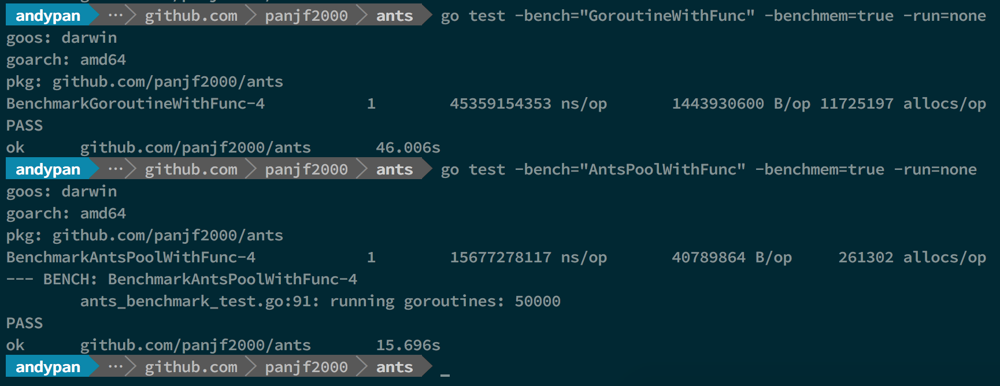
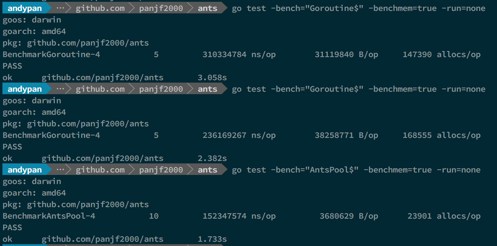
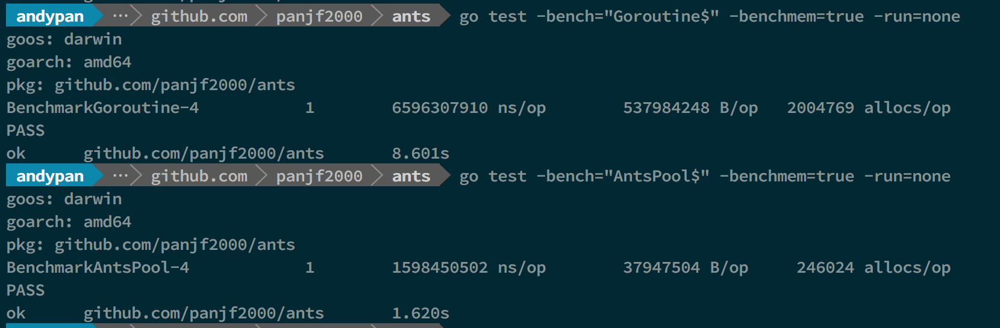

# ants

<div align="center"></div>

<p align="center">A goroutine pool for Go</p>


[![Build Status][1]][2]
[![codecov][3]][4]
[![goreportcard for panjf2000/ants][5]][6]
[![godoc for panjf2000/ants][7]][8]
[![MIT Licence][9]][10]

[中文项目说明](README_ZH.md) | [Project Tutorial](http://blog.taohuawu.club/article/goroutine-pool)

Package ants implements a fixed goroutine pool for managing and recycling a massive number of goroutines, allowing developers to limit the number of goroutines that created by your concurrent programs.

## Features:

- Automatically managing and recycling a massive number of goroutines.
- Periodically clearing overdue goroutines.
- Friendly interfaces: submitting tasks, getting the number of running goroutines, readjusting capacity of pool dynamically, closing pool.
- Efficient in memory usage and it even achieves higher performance than unlimited goroutines in golang.


## How to install

``` sh
go get -u github.com/panjf2000/ants
```

Or, using glide:

``` sh
glide get github.com/panjf2000/ants
```

## How to use
If your program will generate a massive number of goroutines and you don't want them to consume a vast amount of memory, with ants, all you need to do is to import ants package and submit all your tasks to the default limited pool created when ants was imported:

``` go
package main

import (
	"fmt"
	"sync"
	"sync/atomic"
	"time"

	"github.com/panjf2000/ants"
)

var sum int32

func myFunc(i interface{}) error {
	n := i.(int32)
	atomic.AddInt32(&sum, n)
	fmt.Printf("run with %d\n", n)
	return nil
}

func demoFunc() error {
	time.Sleep(10 * time.Millisecond)
	fmt.Println("Hello World!")
	return nil
}

func main() {
	defer ants.Release()

	runTimes := 1000

	// use the common pool
	var wg sync.WaitGroup
	for i := 0; i < runTimes; i++ {
		wg.Add(1)
		ants.Submit(func() error {
			demoFunc()
			wg.Done()
			return nil
		})
	}
	wg.Wait()
	fmt.Printf("running goroutines: %d\n", ants.Running())
	fmt.Printf("finish all tasks.\n")

	// use the pool with a function
	// set 10 the size of goroutine pool and 1 second for expired duration
	p, _ := ants.NewPoolWithFunc(10, func(i interface{}) error {
		myFunc(i)
		wg.Done()
		return nil
	})
	defer p.Release()
	// submit tasks
	for i := 0; i < runTimes; i++ {
		wg.Add(1)
		p.Serve(int32(i))
	}
	wg.Wait()
	fmt.Printf("running goroutines: %d\n", p.Running())
	fmt.Printf("finish all tasks, result is %d\n", sum)
}
```

## Submit tasks
Tasks can be submitted by calling `ants.Submit(func())`
```go
ants.Submit(func() {})
```

## Custom limited pool
Ants also supports custom limited pool. You can use the `NewPool` method to create a pool with the given capacity, as following:

``` go
// set 10000 the size of goroutine pool
p, _ := ants.NewPool(10000)
// submit a task
p.Submit(func() error {})
```

## Readjusting pool capacity
You can change ants pool capacity at any time with `ReSize(int)`:

``` go
pool.ReSize(1000) // Readjust its capacity to 1000
pool.ReSize(100000) // Readjust its capacity to 100000
```

Don't worry about the synchronous problems in this case, this method is thread-safe.

## About sequence
All the tasks submitted to ants pool will not be guaranteed to be processed in order, because those tasks distribute among a series of concurrent workers, thus those tasks are processed concurrently.

## Benchmarks

```
OS : macOS High Sierra
Processor : 2.7 GHz Intel Core i5
Memory : 8 GB 1867 MHz DDR3

Go1.9
```

<div align="center"></div>

 In that benchmark-picture, the first and second benchmarks performed test with 1M tasks and the rest of benchmarks performed test with 10M tasks, both unlimited goroutines and ants pool, and the capacity of this ants goroutine-pool was limited to 50K.

- BenchmarkGoroutine-4 represent the benchmarks with unlimited goroutines in golang.

- BenchmarkPoolGroutine-4 represent the benchmarks with a ants pool.

The test data above is a basic benchmark and the more detailed benchmarks will be uploaded later.

### Benchmarks with Pool 



In that benchmark-picture, the first and second benchmarks performed test with 1M tasks and the rest of benchmarks performed test with 10M tasks, both unlimited goroutines and ants pool, and the capacity of this ants goroutine-pool was limited to 50K.

**As you can see, `ants` can up to 2x faster than goroutines without pool (10M tasks) and it only consumes half memory comparing with goroutines without pool. (both 1M and 10M tasks)**

### Benchmarks with PoolWithFunc



### Throughput ( situation for  only submitting tasks and  need not waiting  for all the tasks to be completed) 

#### 100K tasks



#### 1M tasks



#### 10M tasks


There was only the test of `ants` Pool because my computer was crash when it reached 10M goroutines. 

**As you can see, `ants` can up to 2x~6x faster than goroutines without pool and the memory consumption is reduced by 10 to 20 times.**

[1]: https://travis-ci.com/panjf2000/ants.svg?branch=master
[2]: https://travis-ci.com/panjf2000/ants
[3]: https://codecov.io/gh/panjf2000/ants/branch/master/graph/badge.svg
[4]: https://codecov.io/gh/panjf2000/ants
[5]: https://goreportcard.com/badge/github.com/panjf2000/ants
[6]: https://goreportcard.com/report/github.com/panjf2000/ants
[7]: https://godoc.org/github.com/panjf2000/ants?status.svg
[8]: https://godoc.org/github.com/panjf2000/ants
[9]: https://badges.frapsoft.com/os/mit/mit.svg?v=103
[10]: https://opensource.org/licenses/mit-license.php
